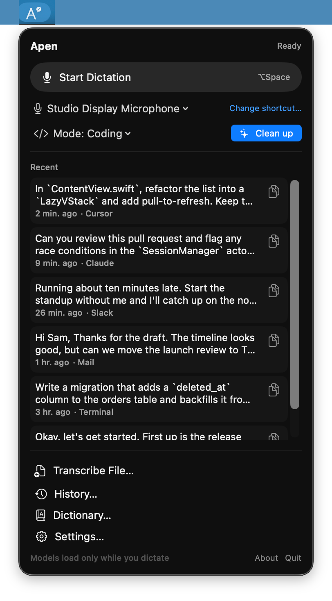
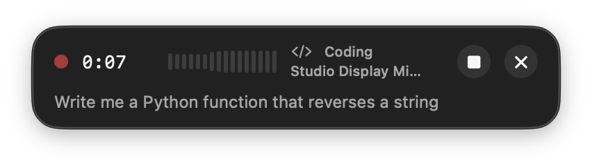
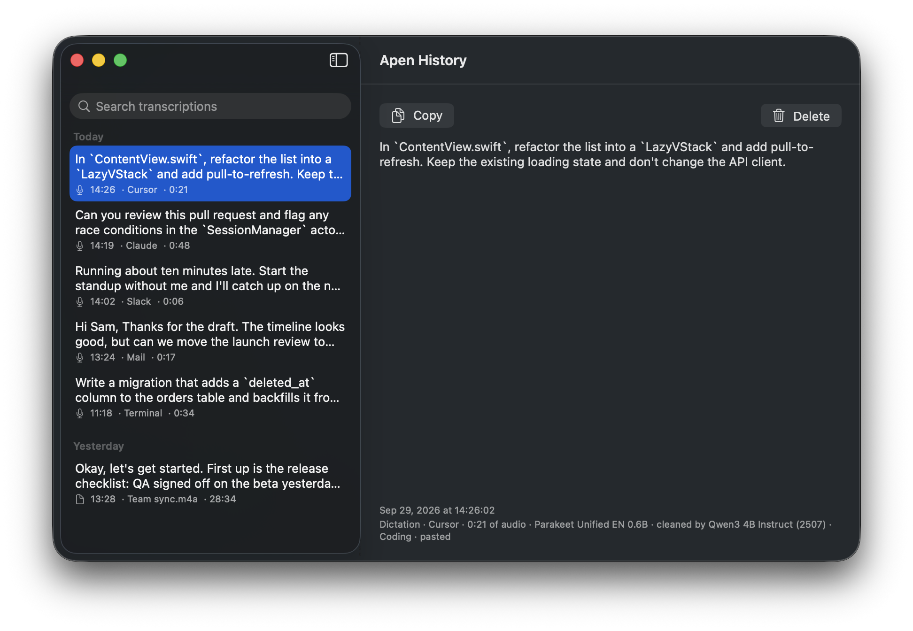
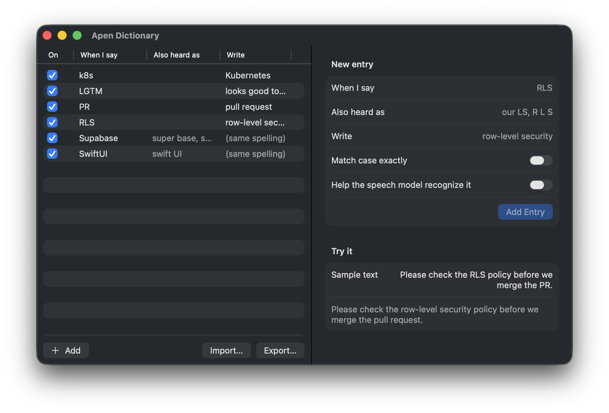
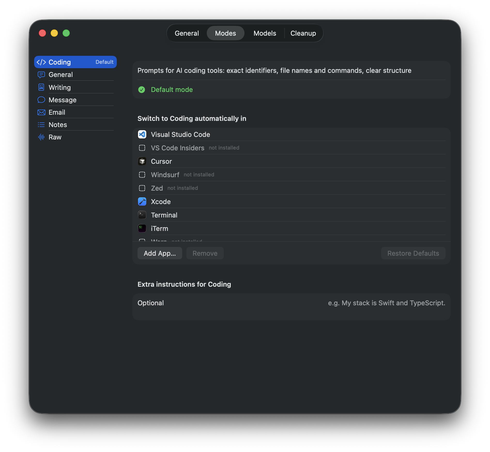
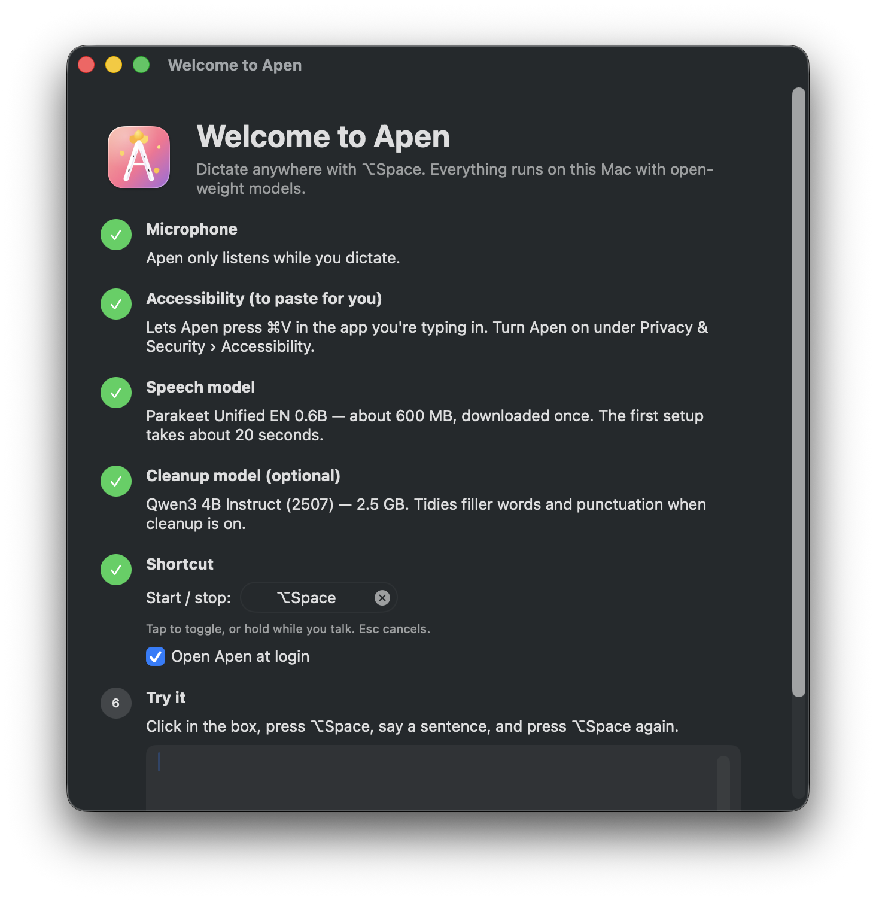
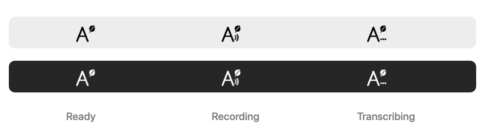

<p align="center">
  
</p>

<h1 align="center">Apen</h1>

<p align="center">
  Local dictation for macOS, a free replacement for Superwhisper. Press <b>⌥Space</b>, talk, and press it again.<br>
  Your words are transcribed on this Mac and pasted into whatever window is selected. Nothing is sent to a server.
</p>

<p align="center">
  
  &nbsp;
  
</p>

- **Menu bar app** with your recent transcripts (one-click Copy), a microphone picker, and the dictation mode.
- **Long dictations**: text is transcribed while you talk, so it's ready about a second after you stop, even after
  ten minutes.
- **Files**: drop an audio or video file on *Transcribe File…*.
- **Open-weight models, on device**: NVIDIA Parakeet Unified EN for speech (Neural Engine). Optionally Qwen3-4B for
  cleanup (GPU).
- **Memory only while working**: models load when you start talking and are released as soon as the text is
  delivered. The cleanup model runs in a helper process that exits afterwards.
- **History**: every transcript is saved locally and searchable.
- **Personal dictionary**: "when I say *RLS*, write *row-level security*". Tolerates `R.L.S.` / `rls` / aliases, and
  can bias the speech model toward your jargon.
- **Modes** for the optional cleanup: Coding (prompts for AI coding tools), General, Writing, Message, Email, Notes,
  Raw. Apps switch modes automatically (Cursor/VS Code/Terminal/Claude → Coding, Slack → Message, Mail → Email…).

## Screenshots

| History | Dictionary |
| --- | --- |
|  |  |
| **Modes** | **Welcome** |
|  |  |

The menu bar icon shows what Apen is doing:



Screenshots use demo data (a Debug build started with `--demo`).

## Install

Apen is built from source on your Mac (a few minutes, mostly downloading packages), then installed as a normal app in
`/Applications`. There's no prebuilt download yet, because distributing one requires Apple notarization.

### What you need

- A Mac with **Apple silicon** (M1 or later) running **macOS 26 Tahoe** or later.
- **Xcode 26 or later**, free from the [App Store](https://apps.apple.com/app/xcode/id497799835). Open it once after
  installing so it can finish setting up. The Command Line Tools alone aren't enough.
- **[Homebrew](https://brew.sh)**, which the installer uses to get XcodeGen (or install
  [XcodeGen](https://github.com/yonaskolb/XcodeGen) yourself).
- About **1 GB** of free space for the speech model, or 3.5 GB with the optional cleanup model.

### Steps

1. Open **Terminal** and run:

   ```bash
   git clone https://github.com/milescs/apen.git
   cd apen
   ./scripts/install.sh
   ```

   The script checks the requirements, builds Apen, copies it to `/Applications/Apen.app` and opens it. Apen lives
   in the **menu bar** (an "A" with a leaf), not the Dock.

2. Follow the **Welcome to Apen** window that opens:
   1. **Microphone**: click *Allow Microphone*.
   2. **Accessibility**: click *Open Accessibility Settings* and turn on **Apen**. This lets it paste into other apps.
   3. **Speech model**: click *Download*. It's about 600 MB, downloaded once, and set up in about 20 seconds.
   4. **Cleanup model** (optional): a 2.5 GB download that tidies filler words and punctuation when cleanup is on.
   5. **Shortcut**: ⌥Space by default; change it here or later in Settings › General. If you use Superwhisper or
      another app on ⌥Space, quit it or pick a different shortcut.
   6. **Try it**: click in the box, tap ⌥Space, say a sentence, and tap ⌥Space again.

3. Optional: turn on **Open Apen at login** in the welcome window or in Settings › General.

### Code signing and permissions

If your Mac has an **Apple Development** certificate, the installer signs Apen with it, and macOS then keeps the
Microphone and Accessibility permissions when you update. You get a free certificate by signing in to Xcode with your
Apple ID (Xcode › Settings › Accounts).

Without a certificate, Apen is signed ad hoc and works the same. The only difference is after an update: if pasting
stops working, open System Settings › Privacy & Security › Accessibility, remove Apen with **−**, and add it again.

### Update

```bash
cd apen
git pull
./scripts/install.sh
```

### Uninstall

1. Quit Apen (menu bar › Quit) and delete `/Applications/Apen.app`.
2. Optionally delete its data:

   ```bash
   rm -rf ~/Library/Application\ Support/Apen
   rm -rf ~/Library/Application\ Support/FluidAudio/Models/parakeet-unified-en-0.6b ~/Library/Application\ Support/FluidAudio/Models/parakeet-ctc-110m-coreml
   defaults delete com.milescs.apen
   ```

3. Remove Apen from System Settings › Privacy & Security › Accessibility and › Microphone.

### Troubleshooting

| Problem | Fix |
| --- | --- |
| Text is copied but not pasted | Turn on Apen under Privacy & Security › Accessibility (remove and re-add it after an ad-hoc rebuild) |
| ⌥Space does nothing | Another app owns the shortcut. Quit it, or set a new shortcut in Settings › General |
| "No speech detected" | Check the microphone picker in the menu bar and the input level in the recording panel |
| First dictation after an update says "Loading model…" for a while | macOS is re-optimizing the model for the Neural Engine (about 20 s, once) |
| `xcodebuild` errors about the Command Line Tools | Run `sudo xcode-select -s /Applications/Xcode.app` |

## Using it

| Action | How |
| --- | --- |
| Dictate | Tap ⌥Space, talk, tap ⌥Space. Or hold ⌥Space while talking and release |
| Cancel | Esc while recording (while processing, Esc skips the paste; the text is still saved) |
| Skip cleanup | Press ⌥Space while "Cleaning up" shows, to paste the uncleaned text now |
| Copy an old transcript | Menu bar › Recent › copy icon, or History (⇧⌘C) |
| Switch microphone | Menu bar › microphone menu (affects Apen only) |
| Pick a mode | Menu bar › Mode, or Settings › Modes to assign apps and add per-mode instructions |
| Transcribe a file | Menu bar › Transcribe File…, drag a file in, or Finder › Open With › Apen |

## Where things live

| What | Where |
| --- | --- |
| History and dictionary | `~/Library/Application Support/Apen/apen.sqlite` |
| Recordings (kept only on failure, or if you choose) | `~/Library/Application Support/Apen/Recordings/` |
| Cleanup model | `~/Library/Application Support/Apen/Models/` |
| Speech models | `~/Library/Application Support/FluidAudio/Models/` |

## Development

```bash
make bootstrap     # installs XcodeGen and generates Apen.xcodeproj
make models        # optional: download the speech models from the command line instead of the app
make test          # unit tests (dictionary, triggers, text, cleanup prompt/guard, stores)
make fixtures      # speech fixtures generated with `say`
make integration   # model-backed tests: accuracy, long-form, latency, boosting, cleanup, memory
make run           # Debug build + launch
./scripts/e2e-paste.sh   # plays a fixture as the mic, checks the paste into TextEdit and the clipboard restore
cd Packages/ApenKit && swift run apen transcribe <file> --memory   # headless transcription + memory report
```

Measured on an M3 Max:

- A 5.2-minute recording transcribes with 0% WER on the `say` fixture, and the final text arrives 0.09 s after
  the audio ends.
- Warm model load takes 0.15–0.4 s. The first load compiles for the Neural Engine (~20 s, done during setup).
- Cleanup takes 0.2–1 s for a typical prompt. The helper starts in 0.35 s warm.
- Memory:
  - Idle: about 42–53 MB for Apen.
  - While dictating: about 60 MB for Apen, plus about 665 MB for the cleanup helper when cleanup is on.
  - After the paste: back to idle, and the helper has exited.

See [AGENTS.md](AGENTS.md) for architecture and conventions.

## License

Apen is released under the [MIT License](LICENSE). The models and libraries it downloads and uses have their own
licenses, listed in [LICENSES/THIRD_PARTY.md](LICENSES/THIRD_PARTY.md). Among them, Parakeet Unified is licensed by
NVIDIA Corporation under the NVIDIA Open Model License.
